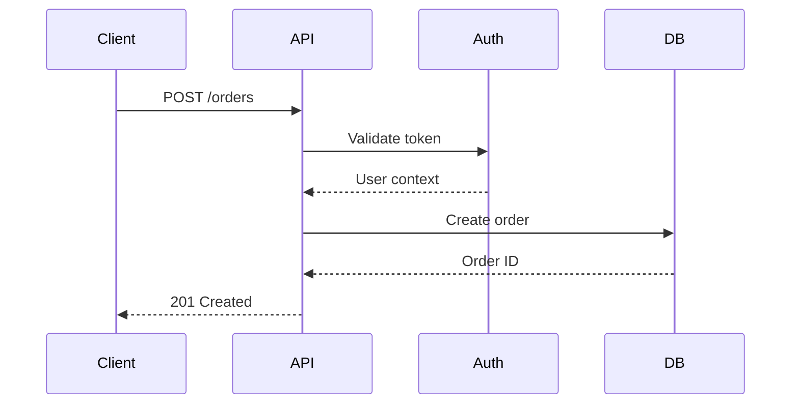
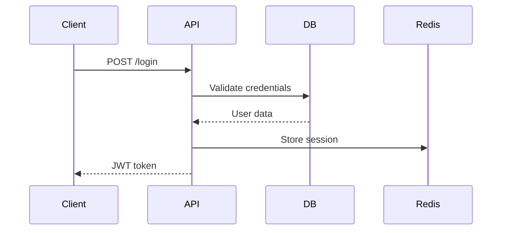

# Technical Specification & Design Documents

> Expert guidance for writing effective technical design documents, RFCs, Architecture Decision Records, and technology evaluation frameworks.

## Core Philosophy

- **Write before code** — Design documents prevent costly rework and align teams
- **Living documents** — Keep docs updated as the system evolves
- **Clarity over completeness** — Simple, direct language reduces cognitive load
- **Diagrams as code** — Version-controlled, maintainable architecture diagrams
- **Decisions over descriptions** — Document why, not just what

---

## Hard Rules (Must Follow)

> These rules are mandatory. Violating them means the skill is not working correctly.

### Alternatives Required

**Every design document must include at least 2 alternative solutions.**

```markdown
❌ FORBIDDEN:
## Solution
We will use PostgreSQL for the database.
(No alternatives considered)

✅ REQUIRED:
## Proposed Solution
PostgreSQL for primary database.

## Alternatives Considered

### Option A: PostgreSQL (Recommended)
**Pros**: ACID compliance, JSON support, mature ecosystem
**Cons**: Vertical scaling limits
**Decision**: Chosen for reliability and team expertise

### Option B: MongoDB
**Pros**: Horizontal scaling, flexible schema
**Cons**: Eventual consistency, less familiar to team
**Decision**: Rejected due to consistency requirements

### Option C: DynamoDB
**Pros**: Serverless, auto-scaling
**Cons**: Vendor lock-in, complex query patterns
**Decision**: Rejected due to query flexibility needs
```

### Diagrams Required

**System designs must include architecture diagrams. No text-only descriptions.**

```markdown
❌ FORBIDDEN:
"The user sends a request to the API, which talks to the database
and returns a response."

✅ REQUIRED:
Include at least one of:
- C4 Context/Container diagram
- Sequence diagram for key flows
- Data flow diagram

Example (Mermaid):

```

### Success Metrics Defined

**Every design must include measurable success criteria.**

```markdown
❌ FORBIDDEN:
## Goals
- Make the system faster
- Improve reliability
- Better user experience

✅ REQUIRED:
## Success Metrics

| Metric | Current | Target | Measurement |
|--------|---------|--------|-------------|
| API Latency (P95) | 500ms | <200ms | Prometheus histogram |
| Availability | 99.5% | 99.9% | Uptime monitoring |
| Error Rate | 2% | <0.1% | Error tracking |
| Throughput | 1K req/s | 10K req/s | Load testing |
```

### Risks and Mitigations

**All designs must identify risks and their mitigations.**

```markdown
❌ FORBIDDEN:
(No risk section, assuming everything will work)

✅ REQUIRED:
## Risks & Mitigations

| Risk | Severity | Likelihood | Mitigation |
|------|----------|------------|------------|
| Database migration fails | High | Medium | Backup + rollback plan, test in staging |
| Third-party API unavailable | Medium | Low | Circuit breaker, fallback cache |
| Team lacks expertise | Medium | Medium | Pair programming, external review |
| Scope creep | High | High | Fixed scope document, change control |
```

---

## When to Use This Skill

| Scenario | Document Type | Complexity |
|----------|--------------|------------|
| New feature design | Technical Design Doc | Medium-High |
| System architecture | C4 Model Diagrams | Medium |
| Major technical decision | Architecture Decision Record (ADR) | Low-Medium |
| Cross-team proposal | RFC (Request for Comments) | Medium-High |
| Technology evaluation | Tech Selection Matrix | Medium |
| API contract | OpenAPI/AsyncAPI Spec | Low-Medium |

---

## Document Types Overview

### Technical Design Document (TDD)
**Purpose**: Blueprint for implementing a feature or system
**Audience**: Engineers, technical leads
**When**: Before implementing significant features
**Sections**: Problem, solution, alternatives, risks, timeline

### RFC (Request for Comments)
**Purpose**: Proposal for discussion and feedback
**Audience**: Cross-functional teams
**When**: Need consensus on technical direction
**Sections**: Problem statement, proposal, trade-offs, open questions

### Architecture Decision Record (ADR)
**Purpose**: Document a single architectural decision
**Audience**: Current and future engineers
**When**: Any architecturally significant choice
**Sections**: Context, decision, consequences, status

### C4 Model Diagrams
**Purpose**: Visualize system architecture at multiple zoom levels
**Audience**: Technical and non-technical stakeholders
**When**: Communicating system structure
**Levels**: Context, Container, Component, Code

---

## Essential Document Sections

### 1. Front Matter

```markdown
# Title: User Authentication System

**Author**: Jane Doe
**Status**: Proposed | In Review | Approved | Implemented
**Created**: 2025-12-18
**Last Updated**: 2025-12-18
**Reviewers**: @tech-lead, @security-team
```

### 2. Problem Statement (The "Why")

```markdown
## Problem

**Current State**: Users authenticate via legacy session cookies, no MFA support.
**Impact**: 23% of security incidents related to compromised credentials.
**Constraint**: Must support 10K concurrent users, <200ms login latency.
**Goal**: Implement secure, scalable authentication with MFA and OAuth support.
```

### 3. Proposed Solution (The "What")

```markdown
## Solution

Implement JWT-based authentication with:
- Access tokens (15min TTL) + Refresh tokens (7 day TTL)
- TOTP-based MFA (Google Authenticator compatible)
- OAuth 2.0 providers (Google, GitHub)
- Redis for token blacklist and session management

### High-Level Design

[Include C4 Container diagram here]

### Data Flow

1. User submits credentials → Auth Service validates
2. Auth Service generates JWT pair, stores refresh token in Redis
3. Client includes access token in Authorization header
4. API Gateway validates token, extracts user context
5. On expiry, client exchanges refresh token for new access token
```

### 4. Alternatives Considered

```markdown
## Alternatives

### Option A: Session-based authentication
**Pros**: Simpler implementation, server-side revocation
**Cons**: Doesn't scale horizontally, higher latency
**Decision**: Rejected - doesn't meet scalability requirements

### Option B: Auth0 (3rd party)
**Pros**: Battle-tested, feature-complete
**Cons**: $500/month cost, vendor lock-in
**Decision**: Deferred - revisit if team velocity insufficient
```

### 5. Risk Assessment

```markdown
## Risks & Mitigations

| Risk | Severity | Likelihood | Mitigation |
|------|----------|------------|------------|
| JWT secret leak | Critical | Low | Rotate secrets quarterly, use HSM |
| Token theft (XSS) | High | Medium | HttpOnly cookies, CSP headers |
| Redis downtime | High | Low | Fallback to stateless validation |
| Clock skew issues | Medium | Medium | Use `nbf` claim, allow 5min tolerance |
```

### 6. Implementation Plan

```markdown
## Work Breakdown

### Phase 1: Core Authentication (Week 1-2)
- [ ] JWT generation/validation service
- [ ] Password hashing (bcrypt)
- [ ] User repository interface
- [ ] Unit tests + integration tests

### Phase 2: MFA (Week 3)
- [ ] TOTP secret generation
- [ ] QR code generation
- [ ] Verification endpoint
- [ ] Backup codes

### Phase 3: OAuth (Week 4)
- [ ] Google OAuth integration
- [ ] GitHub OAuth integration
- [ ] Account linking flow

### Success Metrics
- 100% test coverage for auth logic
- <100ms token validation latency
- Zero security vulnerabilities in audit
```

### 7. Open Questions

```markdown
## Open Questions

1. **Token storage**: Should refresh tokens be in httpOnly cookie or localStorage?
   - **Recommendation**: Cookie (XSS protection), need CSRF mitigation

2. **MFA enforcement**: Opt-in or mandatory for all users?
   - **Requires**: Product team decision

3. **Session limits**: Should we limit concurrent sessions per user?
   - **Impact**: Redis storage requirements, UX complexity
```

---

## Best Practices

### Clarity & Language

```markdown
✅ DO:
- Use simple, direct language
- Define acronyms on first use
- Include diagrams for complex flows
- Use tables for comparisons
- Provide concrete examples

❌ DON'T:
- Use jargon without explanation
- Write walls of text
- Assume prior knowledge
- Skip the "why" behind decisions
- Create docs that become stale
```

### Diagrams

**Mermaid (Simple flows)**


**PlantUML with C4 (Architecture)**
```plantuml
@startuml
!include https://raw.githubusercontent.com/plantuml-stdlib/C4-PlantUML/master/C4_Container.puml

System_Boundary(c1, "Auth System") {
    Container(api, "API Gateway", "Node.js", "Routes requests")
    Container(auth, "Auth Service", "Go", "Handles authentication")
    ContainerDb(redis, "Redis", "Cache", "Sessions & tokens")
}

Person(user, "User")
user -> api : Login request
api -> auth : Validate
auth -> redis : Store token
@enduml
```

### Structure & Templates

**Use consistent templates across your organization:**
- Technical Design Doc → `templates/design-doc-template.md`
- ADR → `templates/adr-template.md`
- Technology evaluation → `reference/tech-selection.md`

### Version Control

```bash
# Store docs with code
docs/
├── architecture/
│   ├── ADRs/
│   │   ├── 001-database-selection.md
│   │   └── 002-api-authentication.md
│   └── diagrams/
│       └── c4-system-context.puml
├── design/
│   └── auth-system-design.md
└── rfcs/
    └── 2025-01-user-authentication.md
```

---

## Traceability & Maintenance

### Link Requirements to Decisions

```markdown
## Requirements Traceability

| Requirement | Design Element | Implementation | Tests |
|-------------|---------------|----------------|-------|
| REQ-001: MFA support | Auth Service TOTP module | `auth/totp.go` | `auth/totp_test.go` |
| REQ-002: OAuth login | OAuth provider adapter | `auth/oauth.go` | `auth/oauth_test.go` |
| REQ-003: <100ms latency | Redis token cache | `middleware/jwt.go` | `benchmark/auth_bench.go` |
```

### Document Lifecycle

```markdown
## Document Status

- **Proposed**: Initial draft, seeking feedback
- **In Review**: Under review by stakeholders
- **Approved**: Accepted, ready for implementation
- **Implemented**: Fully implemented
- **Deprecated**: No longer valid, superseded by ADR-XXX
```

### Review Process

**Before implementation:**
1. Author writes design doc
2. Share with team for async review (2-3 days)
3. Schedule 30-45min readout meeting
4. Address feedback, update doc
5. Get sign-off from tech lead + security (if needed)

**After implementation:**
- Review doc 1 month post-launch
- Update with actual learnings
- Document what changed and why

---

## Anti-Patterns to Avoid

```markdown
❌ Design as justification
   - Don't write docs after implementation to justify decisions
   - Write BEFORE to think through design

❌ Too much detail
   - Don't document every function and variable
   - Focus on system-level design, not line-by-line code

❌ Spec-first waterfall
   - Don't spend months on perfect design
   - Write enough to start, iterate as you learn

❌ Stale documentation
   - Don't let docs drift from reality
   - Update or delete outdated docs

❌ No alternatives analysis
   - Don't present only one solution
   - Show you considered trade-offs

❌ Missing success criteria
   - Don't forget to define "done"
   - Include measurable success metrics
```

---

## Checklist

### Before Writing
- [ ] Understood the problem and constraints
- [ ] Identified stakeholders and reviewers
- [ ] Selected appropriate document type
- [ ] Gathered context (existing systems, data, metrics)

### During Writing
- [ ] Clear problem statement with impact
- [ ] Proposed solution with diagrams
- [ ] Alternatives considered with trade-offs
- [ ] Risk assessment with mitigations
- [ ] Success criteria defined
- [ ] Work breakdown with timeline
- [ ] Open questions documented

### Before Publishing
- [ ] Spell check and grammar review
- [ ] All diagrams render correctly
- [ ] Links are valid
- [ ] Acronyms defined
- [ ] Code examples are tested
- [ ] Requested reviewers identified

### After Implementation
- [ ] Document updated with learnings
- [ ] Status changed to "Implemented"
- [ ] Related ADRs created for key decisions
- [ ] Runbook/operational docs created if needed

---

## Quick Reference Card

```
┌─────────────────────────────────────────────────────────────┐
│           TECHNICAL DOCUMENT QUICK GUIDE                    │
├─────────────────────────────────────────────────────────────┤
│  Document Type Selection                                    │
│  ├── New feature → Technical Design Doc (TDD)               │
│  ├── Architecture → C4 Diagrams + System Design Doc         │
│  ├── Single decision → Architecture Decision Record (ADR)   │
│  ├── Cross-team proposal → Request for Comments (RFC)       │
│  └── Technology choice → Tech Evaluation Matrix             │
├─────────────────────────────────────────────────────────────┤
│  Essential Sections (TDD)                                   │
│  ├── 1. Problem Statement (Why?)                            │
│  ├── 2. Proposed Solution (What?)                           │
│  ├── 3. Alternatives Considered (Why not X?)                │
│  ├── 4. Risk Assessment (What could go wrong?)              │
│  ├── 5. Implementation Plan (How & When?)                   │
│  ├── 6. Success Metrics (How to measure?)                   │
│  └── 7. Open Questions (What's unclear?)                    │
├─────────────────────────────────────────────────────────────┤
│  Best Practices                                             │
│  ├── Write BEFORE implementation                            │
│  ├── Use diagrams for complex flows                         │
│  ├── Keep language simple and direct                        │
│  ├── Show trade-offs, not just solutions                    │
│  ├── Define success criteria                                │
│  └── Update docs as system evolves                          │
└─────────────────────────────────────────────────────────────┘
```

---

## See Also

- [reference/design-doc.md](reference/design-doc.md) — Technical design document guide
- [reference/adr.md](reference/adr.md) — Architecture Decision Records
- [reference/c4-model.md](reference/c4-model.md) — C4 architecture diagrams
- [reference/tech-selection.md](reference/tech-selection.md) — Technology evaluation matrix
- [templates/design-doc-template.md](templates/design-doc-template.md) — TDD template
- [templates/adr-template.md](templates/adr-template.md) — ADR template

---

## Sources

Research based on 2025 best practices from:
- [Technical Design Document Examples 2025](https://www.docuwriter.ai/posts/technical-design-document-examples)
- [Stack Overflow: Practical Guide to Technical Specs](https://stackoverflow.blog/2020/04/06/a-practical-guide-to-writing-technical-specs/)
- [Microsoft Learn: Functional & Technical Design](https://learn.microsoft.com/en-us/dynamics365/guidance/patterns/create-functional-technical-design-document)
- [Atlassian: Software Design Document Best Practices](https://www.atlassian.com/work-management/knowledge-sharing/documentation/software-design-document)
