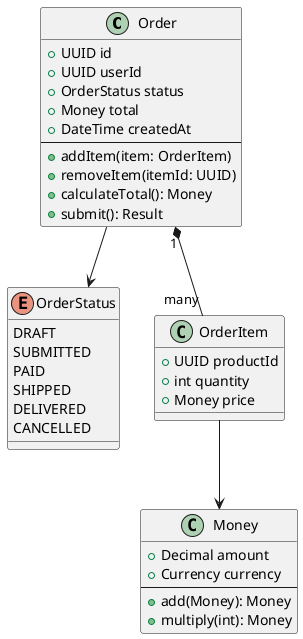
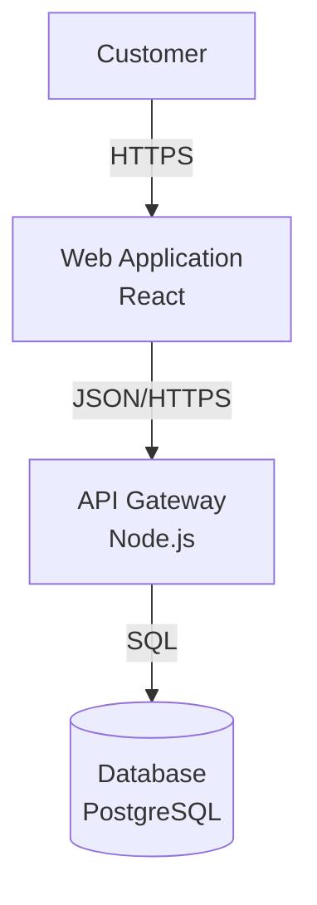

# C4 Model for Software Architecture

> A hierarchical approach to visualizing software architecture at different zoom levels.

## What is the C4 Model?

The C4 model is a lean graphical notation technique for modeling software architecture. Created by Simon Brown, it provides four levels of abstraction:

1. **Context** — System in its environment
2. **Container** — High-level technology choices
3. **Component** — Component responsibilities
4. **Code** — Class diagrams (optional)

**Key principle**: Different diagrams for different audiences, like zooming in on Google Maps.

---

## The Four Levels

```
Level 1: CONTEXT          │ Audience: Everyone
  ↓                       │ Shows: External dependencies
Level 2: CONTAINER        │ Audience: Technical stakeholders
  ↓                       │ Shows: Applications, databases
Level 3: COMPONENT        │ Audience: Developers
  ↓                       │ Shows: Code organization
Level 4: CODE             │ Audience: Developers (optional)
                          │ Shows: Classes, interfaces
```

---

## Level 1: System Context Diagram

**Purpose**: Show your system and its relationships with users and other systems

**Audience**: Everyone (technical and non-technical)

**Elements**:
- Your system (center)
- People (users, actors)
- External systems (databases, APIs, services)

### Example: E-Commerce Platform

```
┌─────────────────────────────────────────────────┐
│                                                 │
│              E-Commerce Platform                │
│                                                 │
│  [Customer]  ──────────► [Web Application]     │
│                                │                │
│                                ↓                │
│                          [Order System]         │
│                                │                │
│                    ┌───────────┼───────────┐    │
│                    ↓           ↓           ↓    │
│            [Payment API] [Email Service] [DB]   │
│              (Stripe)    (SendGrid)             │
│                                                 │
└─────────────────────────────────────────────────┘
```

### PlantUML (C4-PlantUML)

```plantuml
@startuml
!include https://raw.githubusercontent.com/plantuml-stdlib/C4-PlantUML/master/C4_Context.puml

LAYOUT_WITH_LEGEND()

Person(customer, "Customer", "A user of the e-commerce platform")
System(ecommerce, "E-Commerce Platform", "Allows customers to buy products online")

System_Ext(stripe, "Stripe", "Payment processing")
System_Ext(sendgrid, "SendGrid", "Email delivery")
System_Ext(analytics, "Google Analytics", "Usage analytics")

Rel(customer, ecommerce, "Browses products, places orders")
Rel(ecommerce, stripe, "Processes payments via", "HTTPS")
Rel(ecommerce, sendgrid, "Sends emails via", "HTTPS")
Rel(ecommerce, analytics, "Sends events to", "HTTPS")

@enduml
```

### When to Use

- Onboarding new team members
- Explaining system to stakeholders
- Identifying integration points
- Documenting external dependencies

---

## Level 2: Container Diagram

**Purpose**: Show the high-level shape of the architecture and technology choices

**Audience**: Technical stakeholders (developers, architects, ops)

**Elements**:
- Containers (applications, data stores, microservices)
- People (users)
- Technology choices (Node.js, PostgreSQL, Redis)

**Note**: "Container" = separately deployable/runnable unit (not Docker container specifically)

### Example: E-Commerce Platform Containers

```
┌─────────────────────────────────────────────────────────────┐
│                  E-Commerce Platform                        │
│                                                             │
│  [Customer] ──► [Web App]          [Admin] ──► [Admin UI]  │
│                 (React, SPA)                    (React)     │
│                      │                              │       │
│                      ↓                              ↓       │
│                 ┌────────────────────────────────────┐      │
│                 │        API Gateway                 │      │
│                 │        (Node.js, Express)          │      │
│                 └────────────────────────────────────┘      │
│                      │              │             │         │
│          ┌───────────┴──────┬───────┴────────┐    │         │
│          ↓                  ↓                ↓    │         │
│   [Order Service]   [Product Service]  [User Service]      │
│   (Go)              (Go)               (Go)                │
│          │                  │                │              │
│          ↓                  ↓                ↓              │
│   [PostgreSQL]       [PostgreSQL]      [Redis Cache]       │
│   (Orders DB)        (Products DB)     (Sessions)          │
│                                                             │
│                  External Systems:                          │
│                  [Stripe API] [SendGrid] [S3]              │
│                                                             │
└─────────────────────────────────────────────────────────────┘
```

### PlantUML (C4-PlantUML)

```plantuml
@startuml
!include https://raw.githubusercontent.com/plantuml-stdlib/C4-PlantUML/master/C4_Container.puml

LAYOUT_TOP_DOWN()

Person(customer, "Customer")
Person(admin, "Admin User")

System_Boundary(ecommerce, "E-Commerce Platform") {
    Container(web, "Web Application", "React, TypeScript", "Provides e-commerce functionality via browser")
    Container(admin_ui, "Admin UI", "React, TypeScript", "Allows admins to manage products")
    Container(api, "API Gateway", "Node.js, Express", "Routes requests to microservices")

    Container(order_svc, "Order Service", "Go", "Handles order processing")
    Container(product_svc, "Product Service", "Go", "Manages product catalog")
    Container(user_svc, "User Service", "Go", "Handles authentication")

    ContainerDb(order_db, "Order Database", "PostgreSQL", "Stores order data")
    ContainerDb(product_db, "Product Database", "PostgreSQL", "Stores product catalog")
    ContainerDb(cache, "Cache", "Redis", "Stores sessions and cached data")
}

System_Ext(stripe, "Stripe API", "Payment processing")
System_Ext(email, "SendGrid", "Email delivery")

Rel(customer, web, "Uses", "HTTPS")
Rel(admin, admin_ui, "Uses", "HTTPS")

Rel(web, api, "Makes API calls to", "JSON/HTTPS")
Rel(admin_ui, api, "Makes API calls to", "JSON/HTTPS")

Rel(api, order_svc, "Routes to", "gRPC")
Rel(api, product_svc, "Routes to", "gRPC")
Rel(api, user_svc, "Routes to", "gRPC")

Rel(order_svc, order_db, "Reads from and writes to", "SQL")
Rel(product_svc, product_db, "Reads from and writes to", "SQL")
Rel(user_svc, cache, "Reads from and writes to", "Redis protocol")

Rel(order_svc, stripe, "Processes payments via", "HTTPS")
Rel(order_svc, email, "Sends emails via", "HTTPS")

@enduml
```

### When to Use

- Designing system architecture
- Documenting deployment topology
- Understanding technology stack
- Identifying scaling bottlenecks

---

## Level 3: Component Diagram

**Purpose**: Show the components inside a container and their relationships

**Audience**: Developers and architects

**Elements**:
- Components (groups of related functionality)
- Relationships (dependencies, data flow)

### Example: Order Service Components

```
┌─────────────────────────────────────────────────────┐
│              Order Service (Go)                     │
│                                                     │
│  ┌──────────────┐         ┌──────────────┐          │
│  │ API Handler  │────────►│  Order Logic │          │
│  │ (HTTP/gRPC)  │         │  (Business)  │          │
│  └──────────────┘         └──────────────┘          │
│         │                        │                  │
│         │                        ↓                  │
│         │              ┌──────────────────┐         │
│         │              │ Payment Service  │         │
│         │              │   (Client)       │         │
│         │              └──────────────────┘         │
│         ↓                        │                  │
│  ┌──────────────┐                ↓                  │
│  │ Validation   │         [Stripe API]              │
│  │ Middleware   │         (External)                │
│  └──────────────┘                                   │
│         │                                           │
│         ↓                                           │
│  ┌──────────────┐         ┌──────────────┐          │
│  │ Order Repo   │────────►│  PostgreSQL  │          │
│  │ (Data Access)│         │   Database   │          │
│  └──────────────┘         └──────────────┘          │
│                                                     │
└─────────────────────────────────────────────────────┘
```

### PlantUML (C4-PlantUML)

```plantuml
@startuml
!include https://raw.githubusercontent.com/plantuml-stdlib/C4-PlantUML/master/C4_Component.puml

Container(api, "API Gateway", "Node.js")

Container_Boundary(order_svc, "Order Service") {
    Component(handler, "Order API Handler", "Go HTTP handlers", "Handles order requests")
    Component(logic, "Order Business Logic", "Go", "Processes orders, applies rules")
    Component(payment, "Payment Client", "Go", "Integrates with Stripe")
    Component(repo, "Order Repository", "Go", "Data access layer")
    Component(validator, "Validation Middleware", "Go", "Validates requests")
}

ContainerDb(db, "Order Database", "PostgreSQL")
System_Ext(stripe, "Stripe API")

Rel(api, handler, "Calls", "gRPC")
Rel(handler, validator, "Uses")
Rel(validator, logic, "Validates and passes to")
Rel(logic, payment, "Uses")
Rel(logic, repo, "Uses")
Rel(payment, stripe, "Calls", "HTTPS")
Rel(repo, db, "Reads/writes", "SQL")

@enduml
```

### When to Use

- Designing internal structure of a service
- Onboarding developers to a codebase
- Planning refactoring
- Documenting code organization

---

## Level 4: Code Diagram (Optional)

**Purpose**: Show how code is structured (classes, interfaces)

**Audience**: Developers working on specific components

**Note**: Often unnecessary—code itself is the documentation. Use UML class diagrams if helpful.

### Example: Order Class Diagram



### When to Use

- Complex domain models (DDD)
- Explaining design patterns
- Library/framework design

**Generally skip this level** — code is self-documenting with good naming and structure.

---

## Common Patterns

### Microservices Architecture

```plantuml
@startuml
!include https://raw.githubusercontent.com/plantuml-stdlib/C4-PlantUML/master/C4_Container.puml

Person(user, "User")

System_Boundary(platform, "Platform") {
    Container(web, "Web App", "React")
    Container(gateway, "API Gateway", "Node.js")

    Container(svc1, "Service A", "Go")
    Container(svc2, "Service B", "Python")
    Container(svc3, "Service C", "Java")

    ContainerDb(db1, "DB A", "PostgreSQL")
    ContainerDb(db2, "DB B", "MongoDB")
    ContainerDb(db3, "DB C", "PostgreSQL")

    Container(queue, "Message Queue", "RabbitMQ")
}

Rel(user, web, "Uses")
Rel(web, gateway, "Calls", "HTTPS")
Rel(gateway, svc1, "Routes to", "gRPC")
Rel(gateway, svc2, "Routes to", "gRPC")
Rel(gateway, svc3, "Routes to", "gRPC")

Rel(svc1, db1, "Reads/writes")
Rel(svc2, db2, "Reads/writes")
Rel(svc3, db3, "Reads/writes")

Rel(svc1, queue, "Publishes events")
Rel(svc2, queue, "Consumes events")
Rel(svc3, queue, "Consumes events")

@enduml
```

### Monolith Application

```plantuml
@startuml
!include https://raw.githubusercontent.com/plantuml-stdlib/C4-PlantUML/master/C4_Container.puml

Person(user, "User")

System_Boundary(app, "Application") {
    Container(web, "Web Server", "Node.js, Express", "Serves UI and API")
    ContainerDb(db, "Database", "PostgreSQL", "Stores all data")
    ContainerDb(cache, "Cache", "Redis", "Caches frequent queries")
}

System_Ext(cdn, "CDN", "CloudFront")
System_Ext(storage, "Object Storage", "S3")

Rel(user, cdn, "Uses", "HTTPS")
Rel(cdn, web, "Forwards to", "HTTPS")
Rel(web, db, "Reads/writes", "SQL")
Rel(web, cache, "Reads/writes", "Redis")
Rel(web, storage, "Stores files", "HTTPS")

@enduml
```

### Event-Driven Architecture

```plantuml
@startuml
!include https://raw.githubusercontent.com/plantuml-stdlib/C4-PlantUML/master/C4_Container.puml

System_Boundary(platform, "Event-Driven Platform") {
    Container(api, "API Service", "Go")
    Container(worker1, "Email Worker", "Python")
    Container(worker2, "Analytics Worker", "Go")
    Container(worker3, "Notification Worker", "Node.js")

    Container(kafka, "Event Stream", "Kafka", "Event bus")

    ContainerDb(db, "Database", "PostgreSQL")
    ContainerDb(analytics_db, "Analytics DB", "ClickHouse")
}

System_Ext(email, "SendGrid")
System_Ext(push, "Firebase")

Rel(api, kafka, "Publishes events", "Kafka protocol")
Rel(api, db, "Writes", "SQL")

Rel(worker1, kafka, "Subscribes to user.created")
Rel(worker2, kafka, "Subscribes to *")
Rel(worker3, kafka, "Subscribes to order.*")

Rel(worker1, email, "Sends emails")
Rel(worker2, analytics_db, "Writes analytics")
Rel(worker3, push, "Sends notifications")

@enduml
```

---

## Tools for Creating C4 Diagrams

### 1. Structurizr (Official)

**Best for**: Architecture as Code, versioning

```java
// Structurizr DSL
workspace {
    model {
        user = person "Customer"
        ecommerce = softwareSystem "E-Commerce Platform" {
            web = container "Web App" "React"
            api = container "API Gateway" "Node.js"
            db = container "Database" "PostgreSQL"
        }

        user -> web "Uses"
        web -> api "Calls"
        api -> db "Reads/writes"
    }

    views {
        systemContext ecommerce {
            include *
            autolayout
        }

        container ecommerce {
            include *
            autolayout
        }
    }
}
```

### 2. PlantUML + C4-PlantUML

**Best for**: Text-based diagrams, version control

```bash
# Install PlantUML
brew install plantuml

# Generate diagram
plantuml c4-diagram.puml

# Output: c4-diagram.png
```

### 3. IcePanel

**Best for**: Collaborative diagramming, drag-and-drop UI

- Visual editor with C4 support
- Real-time collaboration
- Version control integration

### 4. Draw.io (diagrams.net)

**Best for**: Free, no sign-up, simple diagrams

- C4 shape library available
- Export to PNG, SVG, XML
- Can embed in Confluence/Notion

### 5. Mermaid (Limited C4 Support)

**Best for**: Embedding in Markdown (GitHub, GitLab)



**Note**: Mermaid doesn't have native C4 support, but works for simple diagrams.

---

## Best Practices

### 1. One Diagram Per Abstraction Level

Don't mix levels:
- ❌ Context diagram with code-level details
- ✅ Separate diagrams for each C4 level

### 2. Use Consistent Notation

**Colors**:
- Your system: Blue
- External systems: Gray
- Databases: Green (conventional)

**Shapes**:
- Person: Stick figure or circle
- System: Rectangle
- Container: Rectangle with technology
- Component: Nested rectangle

### 3. Include Technology Choices

**Level 2+ should specify**:
- Programming language (Go, Python, Node.js)
- Framework (React, Express, FastAPI)
- Database (PostgreSQL, MongoDB, Redis)
- Protocol (REST, gRPC, WebSocket)

### 4. Show Relationships Clearly

**Label connections with**:
- Purpose ("Sends emails via")
- Protocol (HTTPS, gRPC, SQL)
- Direction (arrows)

### 5. Keep Diagrams Focused

**Don't show everything**:
- Context: High-level only (5-10 systems max)
- Container: Major containers (10-15 max)
- Component: One container per diagram

### 6. Version Control Diagrams

Store as code:
```bash
docs/
└── architecture/
    ├── c4-context.puml
    ├── c4-container.puml
    ├── c4-order-service-components.puml
    └── diagrams/
        ├── c4-context.png
        └── c4-container.png
```

### 7. Update as System Evolves

Treat diagrams like code:
- Update when architecture changes
- Review in code reviews
- Automated generation when possible

---

## Diagram Checklist

### Level 1: System Context
- [ ] Shows your system as a box
- [ ] Includes all external systems
- [ ] Shows all user types
- [ ] Labels all relationships
- [ ] Uses simple language (non-technical)

### Level 2: Container
- [ ] Shows all containers (apps, services, databases)
- [ ] Includes technology choices
- [ ] Shows communication protocols
- [ ] Separates deployment units
- [ ] Uses consistent notation

### Level 3: Component
- [ ] Focuses on one container
- [ ] Shows major components (not every class)
- [ ] Indicates component responsibilities
- [ ] Shows dependencies clearly
- [ ] Maps to code structure

### General
- [ ] Title is descriptive
- [ ] Legend explains shapes/colors
- [ ] Diagram is not cluttered (split if needed)
- [ ] Text is readable
- [ ] Stored in version control

---

## Common Use Cases

### 1. Onboarding New Engineers

**Provide**:
- Level 1: System context (where does our system fit?)
- Level 2: Container diagram (what are the major parts?)
- Level 3: Component diagrams for services they'll work on

### 2. Architecture Review

**Present**:
- Level 1: Show integration points
- Level 2: Discuss technology choices
- Level 3: Deep dive on complex services

### 3. Incident Response

**Use**:
- Level 2: Identify affected containers
- Level 3: Trace failure through components

### 4. Capacity Planning

**Analyze**:
- Level 2: Identify bottlenecks
- Add annotations for traffic volume
- Highlight scaling constraints

---

## Anti-Patterns

### ❌ Too Much Detail

Don't show every function and variable. Focus on architectural significance.

### ❌ Stale Diagrams

Don't let diagrams drift from reality. Update or delete.

### ❌ Mixing Abstraction Levels

Don't show system context and code classes in the same diagram.

### ❌ Tool Over Content

Don't obsess over tool choice. A hand-drawn sketch is better than no diagram.

### ❌ One Diagram to Rule Them All

Don't try to show everything in one diagram. Create multiple views.

---

## Quick Reference

```
┌─────────────────────────────────────────────────────────┐
│              C4 MODEL QUICK GUIDE                       │
├─────────────────────────────────────────────────────────┤
│  Level 1: CONTEXT                                       │
│  ├── Audience: Everyone                                 │
│  ├── Shows: Your system + external dependencies         │
│  ├── Elements: People, Systems                          │
│  └── Use: High-level communication                      │
├─────────────────────────────────────────────────────────┤
│  Level 2: CONTAINER                                     │
│  ├── Audience: Technical stakeholders                   │
│  ├── Shows: Applications, databases, services           │
│  ├── Elements: Containers (deployable units)            │
│  └── Use: Architecture design, deployment planning      │
├─────────────────────────────────────────────────────────┤
│  Level 3: COMPONENT                                     │
│  ├── Audience: Developers                               │
│  ├── Shows: Components within a container               │
│  ├── Elements: Components (code groupings)              │
│  └── Use: Code organization, refactoring                │
├─────────────────────────────────────────────────────────┤
│  Level 4: CODE (Optional)                               │
│  ├── Audience: Developers                               │
│  ├── Shows: Classes, interfaces                         │
│  ├── Elements: Code-level constructs                    │
│  └── Use: Complex domain models (often skip)            │
└─────────────────────────────────────────────────────────┘
```

---

## References

- [C4 Model Official Site](https://c4model.com/)
- [C4 Model Introduction](https://c4model.com/introduction)
- [IcePanel: How to Create C4 Diagrams](https://icepanel.io/blog/2025-01-30-how-to-create-common-architecture-diagrams-with-the-c4-model)
- [Structurizr](https://structurizr.com/)
- [C4-PlantUML GitHub](https://github.com/plantuml-stdlib/C4-PlantUML)
- [InfoQ: The C4 Model for Software Architecture](https://www.infoq.com/articles/C4-architecture-model/)
