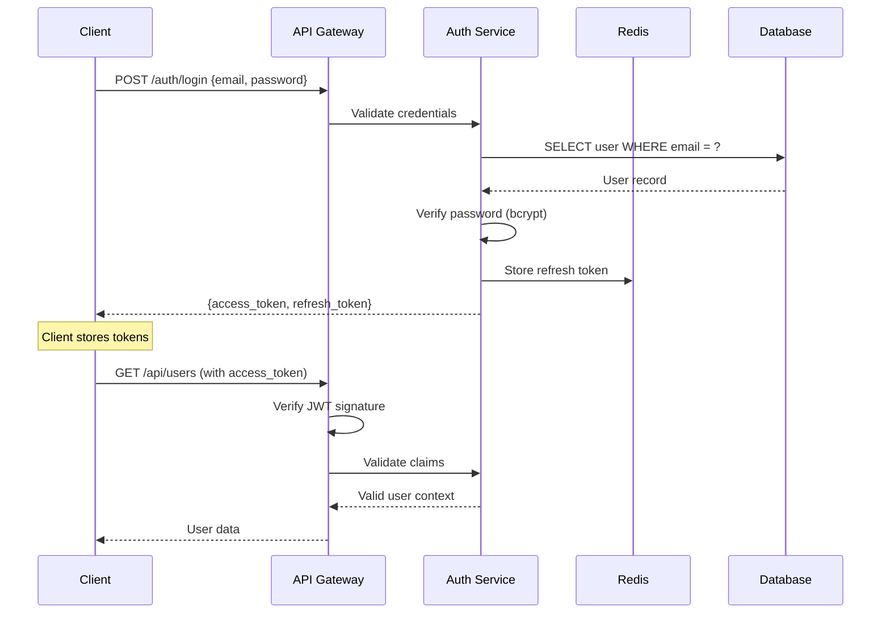

# Technical Design Document Guide

> Comprehensive guide for writing effective technical design documents that enable great engineering decisions.

## What is a Technical Design Document?

A Technical Design Document (TDD) is a detailed blueprint for implementing a feature, system, or architectural change. It serves as:

- **Planning tool** — Forces you to think through design before coding
- **Communication medium** — Aligns teams on approach and trade-offs
- **Decision record** — Documents why certain choices were made
- **Implementation guide** — Provides clear direction for developers
- **Review artifact** — Enables peer review and improvement

---

## When to Write a TDD

### Write a TDD for:

- New features with >1 week implementation time
- Changes to system architecture or data models
- API design (new endpoints or major revisions)
- Performance optimization projects
- Security-sensitive implementations
- Features affecting multiple teams

### Skip the TDD for:

- Bug fixes (unless architectural)
- UI-only changes with no backend impact
- Configuration changes
- Minor refactoring
- Proof-of-concept experiments

**Rule of thumb**: If implementation failure would cost >2 days of rework, write a TDD.

---

## The 7 Essential Parts

Based on industry best practices and Stack Overflow's guidance, every TDD should include:

### 1. Front Matter

**Purpose**: Metadata for tracking and navigation

```markdown
# User Authentication System

**Author**: Jane Doe (@jane)
**Reviewers**: @tech-lead, @security-team, @backend-team
**Status**: In Review
**Created**: 2025-12-18
**Last Updated**: 2025-12-18
**Related Docs**:
  - [ADR-003: JWT vs Sessions](../architecture/ADRs/003-jwt-sessions.md)
  - [API Security Standards](../standards/api-security.md)
```

### 2. Introduction

**Purpose**: Set context and explain the "why"

```markdown
## Introduction

### Background
Our current authentication system uses stateful sessions stored in PostgreSQL,
requiring database queries for every API request. This creates:
- High database load (40% of queries are session lookups)
- Poor horizontal scalability (session affinity required)
- No support for mobile app tokens

### Problem Statement
We need an authentication system that:
1. Scales to 100K concurrent users (current: 10K)
2. Supports mobile clients with long-lived tokens
3. Reduces database load by 50%
4. Enables Multi-Factor Authentication (MFA)

### Goals & Non-Goals

**Goals**:
- ✅ Implement stateless JWT authentication
- ✅ Add TOTP-based MFA support
- ✅ Support OAuth 2.0 (Google, GitHub)
- ✅ Maintain <100ms authentication latency

**Non-Goals**:
- ❌ Migrate existing user sessions (handled separately)
- ❌ Build password reset UI (already exists)
- ❌ Support SSO/SAML (future work)
```

### 3. Solution Overview

**Purpose**: High-level design before diving into details

```markdown
## Proposed Solution

### Architecture

We'll implement a token-based authentication system using:

**Core Components**:
- **Auth Service**: Handles login, token generation, MFA verification
- **JWT Middleware**: Validates tokens on every API request
- **Redis**: Stores refresh tokens and MFA secrets
- **OAuth Adapter**: Integrates with external providers

**Token Strategy**:
- Access tokens: Short-lived (15min), stateless JWT
- Refresh tokens: Long-lived (7 days), stored in Redis
- MFA tokens: One-time, 30-second validity

### C4 Container Diagram

[Insert diagram here - see c4-model.md for guidance]

### Authentication Flow



### Data Models

**User Table** (PostgreSQL):
```sql
CREATE TABLE users (
  id UUID PRIMARY KEY,
  email TEXT UNIQUE NOT NULL,
  password_hash TEXT NOT NULL,
  mfa_enabled BOOLEAN DEFAULT FALSE,
  mfa_secret TEXT,
  created_at TIMESTAMPTZ DEFAULT NOW()
);
```

**Refresh Tokens** (Redis):
```
Key: refresh_token:{token_id}
Value: {user_id, issued_at, expires_at}
TTL: 7 days
```

**JWT Payload**:
```json
{
  "sub": "user_uuid",
  "email": "user@example.com",
  "role": "user",
  "iat": 1735209600,
  "exp": 1735210500,
  "jti": "token_uuid"
}
```
```

### 4. Detailed Design

**Purpose**: Technical specifics for implementation

```markdown
## Detailed Design

### Component: Auth Service

**API Endpoints**:

```typescript
// POST /auth/login
interface LoginRequest {
  email: string;
  password: string;
  mfa_code?: string;  // Optional, required if MFA enabled
}

interface LoginResponse {
  access_token: string;   // JWT, 15min expiry
  refresh_token: string;  // Opaque token, 7 day expiry
  requires_mfa: boolean;  // True if MFA enabled but code not provided
}

// POST /auth/refresh
interface RefreshRequest {
  refresh_token: string;
}

interface RefreshResponse {
  access_token: string;
  refresh_token: string;  // New refresh token (rotation)
}

// POST /auth/logout
interface LogoutRequest {
  refresh_token: string;
}
// Response: 204 No Content
```

**Password Hashing**:
- Algorithm: bcrypt
- Work factor: 12 (recommended for 2025)
- Salt: Auto-generated per password

**JWT Configuration**:
- Algorithm: RS256 (asymmetric)
- Public key: Distributed to all services
- Private key: Stored in Auth Service only (HSM in production)
- Header: `Authorization: Bearer <token>`

### Component: MFA Service

**TOTP Implementation**:
```typescript
interface MFASetup {
  secret: string;          // Base32-encoded secret
  qr_code_url: string;     // otpauth:// URL for QR generation
  backup_codes: string[];  // 10 single-use codes
}

// Library: speakeasy or otpauth
// Time step: 30 seconds
// Digits: 6
// Algorithm: SHA1 (TOTP standard)
```

**Backup Codes**:
- Generated on MFA setup
- 10 codes, single-use
- Stored hashed in database
- Auto-regenerate when <3 remaining

### Component: OAuth Integration

**Supported Providers**:
- Google OAuth 2.0
- GitHub OAuth Apps

**Flow**:
1. Client redirects to `/auth/oauth/{provider}`
2. Auth Service redirects to provider's authorization URL
3. User authorizes, provider redirects back with code
4. Auth Service exchanges code for access token
5. Fetch user profile from provider
6. Create or link user account
7. Return JWT + refresh token

**Account Linking**:
- If email matches existing user → link accounts
- If new email → create new user
- Store provider + provider_user_id for future logins
```

### 5. Alternatives Considered

**Purpose**: Show you evaluated options, build confidence in decision

```markdown
## Alternatives Considered

### Alternative 1: Keep Session-Based Auth

**How it works**: Continue using PostgreSQL-backed sessions

**Pros**:
- No migration needed
- Server-side revocation is instant
- Simpler implementation

**Cons**:
- Doesn't scale horizontally (session affinity needed)
- High database load (every request queries DB)
- Poor mobile app support (cookies don't work well)

**Decision**: ❌ Rejected — Doesn't meet scalability requirements

---

### Alternative 2: Opaque Tokens (OAuth 2.0 style)

**How it works**: Generate random tokens, store in database

**Pros**:
- Easy revocation (delete from database)
- Can store additional session metadata

**Cons**:
- Still requires database lookup on every request
- Doesn't solve scalability problem
- More complex than JWT

**Decision**: ❌ Rejected — Same scalability issues as sessions

---

### Alternative 3: Use Auth0 (SaaS)

**How it works**: Outsource authentication to Auth0

**Pros**:
- Battle-tested, enterprise-grade
- Features: MFA, OAuth, SSO out of the box
- Reduces engineering time

**Cons**:
- Cost: $228/month (Essentials tier)
- Vendor lock-in
- Data privacy concerns (user data leaves our infrastructure)

**Decision**: ⏸️ Deferred — Revisit if implementation takes >1 month

---

### Alternative 4: Stateless JWT (Chosen)

**How it works**: Self-contained tokens verified via signature

**Pros**:
- Scales horizontally (no shared state)
- Zero database lookups for validation
- Works great with microservices
- Industry standard

**Cons**:
- Cannot revoke individual tokens (mitigated by short expiry + refresh tokens)
- Slightly larger payload size (not significant)

**Decision**: ✅ Selected — Best balance of scalability, security, and simplicity
```

### 6. Risks & Mitigations

**Purpose**: Proactively identify what could go wrong

```markdown
## Risk Assessment

### Technical Risks

| Risk | Impact | Likelihood | Mitigation |
|------|--------|------------|------------|
| **JWT Secret Leak** | Critical - All tokens compromised | Low | • Use RS256 (asymmetric)<br>• Private key in HSM<br>• Rotate keys quarterly<br>• Monitor for suspicious claims |
| **XSS Token Theft** | High - User account takeover | Medium | • HttpOnly cookies for refresh tokens<br>• CSP headers<br>• XSS protection middleware<br>• Short access token TTL |
| **Redis Downtime** | High - Auth unavailable | Low | • Redis Sentinel (HA)<br>• Fallback: Stateless mode (no refresh tokens)<br>• Monitoring & alerts |
| **Clock Skew** | Medium - Token validation fails | Medium | • Use `nbf` (not before) claim<br>• Allow 5min tolerance<br>• Monitor server time sync |
| **Brute Force Attacks** | Medium - Password guessing | Medium | • Rate limiting (5 attempts/15min)<br>• Account lockout<br>• Email alerts on failed attempts |

### Operational Risks

| Risk | Impact | Likelihood | Mitigation |
|------|--------|------------|------------|
| **Migration Issues** | High - User login failures | Medium | • Feature flag rollout<br>• Parallel running (old + new)<br>• Gradual user migration<br>• Rollback plan |
| **Performance Degradation** | Medium - Slow auth | Low | • Load testing (10K concurrent users)<br>• Token caching<br>• Redis connection pooling |
| **Key Rotation Failure** | Medium - Auth outage | Low | • Dual-key validation (old + new)<br>• Automated rotation<br>• Runbook for manual rotation |

### Security Risks

| Risk | Impact | Likelihood | Mitigation |
|------|--------|------------|------------|
| **Replay Attacks** | Medium - Token reuse | Low | • Use `jti` (JWT ID) claim<br>• Short-lived tokens<br>• Track token usage in Redis |
| **MFA Bypass** | High - Account takeover | Low | • Backup codes stored hashed<br>• Rate limit MFA attempts<br>• Audit log all MFA events |
```

### 7. Implementation Plan

**Purpose**: Break down work into concrete, trackable tasks

```markdown
## Implementation Plan

### Phase 1: Core JWT Authentication (Week 1-2)
**Goal**: Replace session-based auth with JWT

**Tasks**:
- [ ] Set up JWT library (jsonwebtoken or jose)
- [ ] Generate RSA key pair for signing
- [ ] Implement token generation endpoint (`/auth/login`)
- [ ] Implement token validation middleware
- [ ] Create refresh token flow
- [ ] Unit tests (90% coverage target)
- [ ] Integration tests (login, refresh, logout flows)

**Deliverables**:
- Working JWT auth in staging environment
- Postman collection for testing
- Performance benchmark results

**Risk**: Key management complexity
**Mitigation**: Start with simple file-based keys, migrate to HSM in Phase 4

---

### Phase 2: MFA Support (Week 3)
**Goal**: Add two-factor authentication

**Tasks**:
- [ ] TOTP secret generation
- [ ] QR code generation endpoint
- [ ] MFA verification in login flow
- [ ] Backup code generation & storage
- [ ] MFA enable/disable endpoints
- [ ] Unit tests for TOTP validation
- [ ] E2E tests with Google Authenticator

**Deliverables**:
- MFA setup flow functional
- User documentation for MFA enrollment

**Risk**: Clock sync issues between server and client
**Mitigation**: Allow 1-step time drift (±30 seconds)

---

### Phase 3: OAuth Integration (Week 4)
**Goal**: Support Google and GitHub login

**Tasks**:
- [ ] OAuth client registration (Google, GitHub)
- [ ] OAuth callback handler
- [ ] User profile fetching
- [ ] Account linking logic
- [ ] OAuth login UI (redirect flow)
- [ ] Integration tests with OAuth mocks

**Deliverables**:
- Working OAuth login for Google & GitHub
- Account linking functional

**Risk**: OAuth provider API changes
**Mitigation**: Use official SDKs, monitor provider changelogs

---

### Phase 4: Production Hardening (Week 5)
**Goal**: Security, monitoring, migration

**Tasks**:
- [ ] Move JWT private key to HSM
- [ ] Set up Redis Sentinel for HA
- [ ] Implement rate limiting
- [ ] Add auth event logging
- [ ] Set up monitoring dashboards
- [ ] Create runbooks for key rotation, Redis failover
- [ ] Security audit (internal)
- [ ] Load testing (10K concurrent users)
- [ ] Feature flag setup for gradual rollout

**Deliverables**:
- Production-ready auth service
- Monitoring & alerting configured
- Migration plan approved

---

### Success Metrics

**Performance**:
- [ ] Token validation latency: <50ms (p95)
- [ ] Login latency: <200ms (p95)
- [ ] Support 10K concurrent users with <5% error rate

**Reliability**:
- [ ] 99.9% uptime for auth service
- [ ] Zero security incidents in first month
- [ ] <1% of users experience login issues during migration

**Testing**:
- [ ] 90%+ code coverage
- [ ] All critical paths tested (login, refresh, MFA, OAuth)
- [ ] Security scan passes (no critical/high vulnerabilities)

**Documentation**:
- [ ] API documentation published
- [ ] User guide for MFA enrollment
- [ ] Runbooks for operations team

---

### Rollout Plan

**Week 6: Internal Testing**
- Deploy to staging
- Test with internal users (engineering team)
- Fix any critical issues

**Week 7: Canary Release (5%)**
- Feature flag: 5% of production users
- Monitor error rates, latency
- Rollback if >1% error rate

**Week 8: Gradual Rollout (25% → 50% → 100%)**
- Increase to 25% if canary successful
- Monitor for 2 days
- Increase to 50%, then 100%

**Week 9: Cleanup**
- Remove old session-based auth code
- Delete unused database tables
- Update documentation
```

---

## Open Questions

**Purpose**: Clarify ambiguities before implementation

```markdown
## Open Questions

### 1. Token Storage: Cookie vs. localStorage?

**Question**: Should refresh tokens be stored in httpOnly cookies or localStorage?

**Options**:
- **Cookie**: Safer (XSS-proof), requires CSRF protection
- **localStorage**: Vulnerable to XSS, but easier for mobile apps

**Recommendation**: Use httpOnly cookie for web, allow Authorization header for mobile
**Status**: ⏳ Pending security team review

---

### 2. MFA Enforcement Policy

**Question**: Should MFA be opt-in or mandatory?

**Options**:
- **Opt-in**: Better UX, lower adoption
- **Mandatory**: Better security, potential user friction
- **Mandatory for admins**: Balanced approach

**Recommendation**: Opt-in initially, mandatory for admin roles
**Status**: ⏳ Pending product team decision

---

### 3. Session Concurrency Limit

**Question**: Should we limit concurrent sessions per user?

**Impact**:
- **Limit to 1**: Better security, poor UX (can't use phone + laptop)
- **Limit to 5**: Balanced
- **Unlimited**: Easier to share accounts (security risk)

**Recommendation**: Limit to 5 devices, show active sessions in user settings
**Status**: ⏳ Pending product team decision
**Required by**: Phase 4 (Week 5)

---

### 4. OAuth Email Verification

**Question**: Should we trust OAuth provider's email as verified?

**Context**: Google/GitHub emails are verified, but user could revoke access

**Options**:
- **Trust provider**: Faster onboarding
- **Require re-verification**: More secure, but worse UX

**Recommendation**: Trust provider, but periodically re-check
**Status**: ✅ Resolved — Trust provider

---

### 5. Key Rotation Frequency

**Question**: How often should we rotate JWT signing keys?

**Industry Standard**: 90 days

**Options**:
- **30 days**: More secure, more operational burden
- **90 days**: Industry standard
- **180 days**: Less burden, higher risk if key leaks

**Recommendation**: 90 days, with automated rotation
**Status**: ⏳ Pending DevOps team review
```

---

## Best Practices for Writing TDDs

### 1. Start with the Problem

**Don't jump to solutions**. Clearly articulate:
- What's broken or missing?
- What's the business impact?
- What are the constraints?

### 2. Show Your Work

**Include alternatives**. Even if you're confident in your solution, show you considered other options. This builds trust.

### 3. Use Diagrams Generously

A diagram is worth a thousand words:
- Sequence diagrams for flows
- C4 diagrams for architecture
- Entity-relationship diagrams for data models
- State diagrams for complex state machines

### 4. Be Specific About Risks

Don't just list risks—include:
- Severity (Critical, High, Medium, Low)
- Likelihood (High, Medium, Low)
- Concrete mitigations

### 5. Define Success

Include measurable success criteria:
- Performance metrics (latency, throughput)
- Test coverage targets
- Error rate thresholds
- User impact metrics

### 6. Make it Skimmable

Use:
- Short paragraphs
- Bullet points
- Tables for comparisons
- Headings for navigation
- Code blocks for technical details

### 7. Keep it Updated

A stale doc is worse than no doc:
- Update status as implementation progresses
- Add learnings after launch
- Link to related ADRs for decisions made during implementation

---

## Review Process

### Self-Review Checklist

Before sharing with team:
- [ ] Problem statement is clear (can explain to non-engineer)
- [ ] Solution includes diagrams
- [ ] Alternatives are evaluated with pros/cons
- [ ] Risks are identified with mitigations
- [ ] Success criteria are measurable
- [ ] Work is broken down into <1 week tasks
- [ ] Open questions are clearly marked
- [ ] All acronyms are defined
- [ ] Code examples are tested

### Team Review

**Best practice: Readout meetings** (Amazon-style)
1. Share doc 2 days before meeting
2. Start meeting with 15min silent reading
3. Collect written comments in doc
4. Discuss high-level concerns first
5. Address detailed questions
6. Capture action items
7. Update doc with decisions

**Review focus areas**:
- **Tech Lead**: Architecture soundness, scalability
- **Security**: Threat model, mitigations
- **DevOps**: Operational complexity, monitoring
- **Product**: User impact, timeline

---

## Anti-Patterns

### ❌ The Novel

**Problem**: 50-page docs that nobody reads

**Solution**: Be concise. If >10 pages, break into sections or link to appendices.

### ❌ The After-the-Fact Justification

**Problem**: Writing design doc after code is written

**Solution**: Write BEFORE implementation. Use as planning tool, not CYA artifact.

### ❌ The Implementation Guide

**Problem**: Documenting every function and variable

**Solution**: Focus on system-level design. Code should be self-documenting.

### ❌ The Abandoned Doc

**Problem**: Status says "Proposed" but feature shipped 6 months ago

**Solution**: Update status. Add post-implementation learnings.

### ❌ The Single-Option Proposal

**Problem**: Only presents author's preferred solution

**Solution**: Always include alternatives, even if briefly.

### ❌ The Missing "Why"

**Problem**: Describes what will be built, not why

**Solution**: Start with problem statement. Explain impact and constraints.

---

## Template

See [templates/design-doc-template.md](../templates/design-doc-template.md) for a copy-paste ready template.

---

## References

- [Stack Overflow: A Practical Guide to Writing Technical Specs](https://stackoverflow.blog/2020/04/06/a-practical-guide-to-writing-technical-specs/)
- [DocuWriter: 6 Top Technical Design Document Examples for 2025](https://www.docuwriter.ai/posts/technical-design-document-examples)
- [Atlassian: Software Design Document Best Practices](https://www.atlassian.com/work-management/knowledge-sharing/documentation/software-design-document)
- [Microsoft Learn: Create Functional and Technical Design Document](https://learn.microsoft.com/en-us/dynamics365/guidance/patterns/create-functional-technical-design-document)
