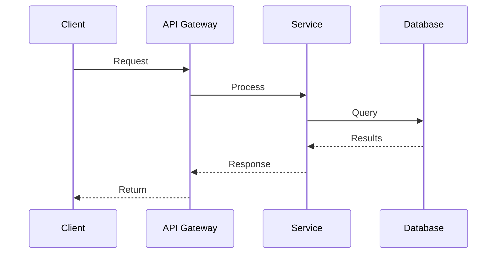

# [Feature/System Name]

**Author**: [Your Name] (@username)
**Reviewers**: @tech-lead, @team-member-1, @team-member-2
**Status**: Proposed | In Review | Approved | Implemented
**Created**: YYYY-MM-DD
**Last Updated**: YYYY-MM-DD

**Related Documents**:
- [ADR-XXX: Related Decision](../architecture/ADRs/XXX-decision.md)
- [Existing Design Doc](../design/existing-doc.md)

---

## Table of Contents

1. [Introduction](#introduction)
2. [Problem Statement](#problem-statement)
3. [Goals & Non-Goals](#goals--non-goals)
4. [Proposed Solution](#proposed-solution)
5. [Detailed Design](#detailed-design)
6. [Alternatives Considered](#alternatives-considered)
7. [Risk Assessment](#risk-assessment)
8. [Implementation Plan](#implementation-plan)
9. [Success Metrics](#success-metrics)
10. [Open Questions](#open-questions)
11. [Appendix](#appendix)

---

## Introduction

### Background

[Explain the current state and context. What exists today? What are we building on?]

**Current System**:
- [Describe existing system/architecture]
- [Key limitations or pain points]
- [Relevant metrics (performance, scale, cost)]

**Why This Matters**:
- [Business impact]
- [User impact]
- [Technical debt or limitations]

### Problem Statement

[Clearly articulate the problem you're solving. What's broken or missing?]

**The Problem**:
[1-2 paragraph description of the problem]

**Impact**:
- **Users**: [How does this affect users?]
- **Business**: [Revenue, cost, growth impact]
- **Engineering**: [Technical debt, velocity, reliability]

**Quantify the Problem** (if possible):
- [Metric 1]: Current state, target state
- [Metric 2]: Current state, target state

---

## Goals & Non-Goals

### Goals

**What we're trying to achieve**:

1. **Primary Goal**: [Main objective]
   - Success criteria: [How do we know we succeeded?]

2. **Secondary Goal**: [Supporting objective]
   - Success criteria: [Measurable outcome]

3. **Tertiary Goal**: [Nice-to-have]
   - Success criteria: [Optional metric]

### Non-Goals

**What we're explicitly NOT doing**:

- ❌ [Thing we're not doing and why]
- ❌ [Another thing we're not doing]
- ❌ [Future work that's out of scope]

**Why this matters**: [Explain scope boundaries to prevent scope creep]

---

## Proposed Solution

### High-Level Overview

[Explain the solution in 2-3 paragraphs. Make it understandable to a non-expert.]

**In a nutshell**:
[One-sentence summary of the solution]

**How it works**:
[Step-by-step explanation at a high level]

### Architecture Diagram

[Include C4 Container or Component diagram]

```
┌─────────────────────────────────────────────────┐
│                                                 │
│  [Insert architecture diagram here]             │
│  Use C4 model, sequence diagram, or other       │
│  visual representation                          │
│                                                 │
└─────────────────────────────────────────────────┘
```

### Key Components

| Component | Technology | Responsibility |
|-----------|------------|----------------|
| [Component 1] | [Tech stack] | [What it does] |
| [Component 2] | [Tech stack] | [What it does] |
| [Component 3] | [Tech stack] | [What it does] |

### Data Flow

[Describe how data flows through the system]



Or describe in steps:
1. [User action or event]
2. [System processes request]
3. [Data is stored/retrieved]
4. [Response is returned]

---

## Detailed Design

### Component 1: [Name]

**Purpose**: [What this component does]

**API/Interface**:

```typescript
// Example API definition
interface ComponentAPI {
  method1(input: InputType): Promise<OutputType>;
  method2(param: ParamType): ResultType;
}
```

**Data Models**:

```sql
-- Database schema (if applicable)
CREATE TABLE example (
  id UUID PRIMARY KEY,
  name TEXT NOT NULL,
  created_at TIMESTAMPTZ DEFAULT NOW()
);
```

Or:

```typescript
// TypeScript type definition
interface Example {
  id: string;
  name: string;
  createdAt: Date;
}
```

**Key Algorithms/Logic**:
[Describe any complex algorithms, business rules, or logic]

**Error Handling**:
[How does this component handle failures?]

---

### Component 2: [Name]

[Repeat structure for each major component]

---

### Security Considerations

**Authentication**:
- [How users/systems authenticate]
- [Token format, protocol, etc.]

**Authorization**:
- [How permissions are enforced]
- [Role-based, attribute-based, etc.]

**Data Protection**:
- [Encryption at rest]
- [Encryption in transit]
- [PII handling]

**Vulnerabilities & Mitigations**:

| Threat | Risk Level | Mitigation |
|--------|------------|------------|
| [Threat 1] | High/Medium/Low | [How we mitigate] |
| [Threat 2] | High/Medium/Low | [How we mitigate] |

---

### Performance Considerations

**Expected Load**:
- [Requests per second]
- [Concurrent users]
- [Data volume]

**Performance Targets**:

| Metric | Current | Target | How to Achieve |
|--------|---------|--------|----------------|
| Latency (p95) | [X ms] | [Y ms] | [Strategy] |
| Throughput | [X req/s] | [Y req/s] | [Strategy] |
| Database queries | [X qps] | [Y qps] | [Caching, indexing] |

**Bottlenecks**:
- [Identified bottleneck 1]
- [Identified bottleneck 2]

---

### Scalability

**Horizontal Scaling**:
- [How system scales out]
- [Load balancing strategy]

**Vertical Scaling**:
- [Resource requirements]
- [Scaling limits]

**Data Partitioning** (if applicable):
- [Sharding strategy]
- [Partition key]

---

### Monitoring & Observability

**Metrics to Track**:

| Metric | Type | Alert Threshold |
|--------|------|-----------------|
| [Metric 1] | Counter/Gauge/Histogram | [When to alert] |
| [Metric 2] | Counter/Gauge/Histogram | [When to alert] |

**Logging**:
- [What to log]
- [Log levels and when to use]
- [Structured logging fields]

**Tracing**:
- [Distributed tracing approach]
- [Trace context propagation]

**Dashboards**:
- [Key dashboards to create]

---

## Alternatives Considered

### Alternative 1: [Name]

**How it works**:
[Brief description]

**Pros**:
- ✅ [Advantage 1]
- ✅ [Advantage 2]

**Cons**:
- ❌ [Disadvantage 1]
- ❌ [Disadvantage 2]

**Decision**: ❌ Rejected | ⏸️ Deferred | ✅ Selected

**Rationale**: [Why this option was rejected/deferred/selected]

---

### Alternative 2: [Name]

[Repeat structure for each alternative]

---

### Comparison Table

| Criteria | Proposed Solution | Alternative 1 | Alternative 2 |
|----------|-------------------|---------------|---------------|
| Performance | ★★★★☆ | ★★★☆☆ | ★★★★★ |
| Complexity | Medium | Low | High |
| Cost | $X/month | $Y/month | $Z/month |
| Time to implement | X weeks | Y weeks | Z weeks |
| Team familiarity | High | Medium | Low |

---

## Risk Assessment

### Technical Risks

| Risk | Severity | Likelihood | Impact | Mitigation |
|------|----------|------------|--------|------------|
| [Risk 1] | Critical/High/Medium/Low | High/Medium/Low | [What happens if it occurs] | [How to prevent/mitigate] |
| [Risk 2] | Critical/High/Medium/Low | High/Medium/Low | [What happens if it occurs] | [How to prevent/mitigate] |

### Operational Risks

| Risk | Severity | Likelihood | Impact | Mitigation |
|------|----------|------------|--------|------------|
| [Risk 1] | Critical/High/Medium/Low | High/Medium/Low | [What happens if it occurs] | [How to prevent/mitigate] |
| [Risk 2] | Critical/High/Medium/Low | High/Medium/Low | [What happens if it occurs] | [How to prevent/mitigate] |

### Dependencies

**External Dependencies**:
- [Third-party service 1]: [Risk if unavailable]
- [Third-party service 2]: [Risk if unavailable]

**Internal Dependencies**:
- [Team/system 1]: [What we need from them]
- [Team/system 2]: [Timeline dependencies]

---

## Implementation Plan

### Phase 1: [Name] (Week X-Y)

**Goal**: [What this phase achieves]

**Tasks**:
- [ ] [Task 1]
- [ ] [Task 2]
- [ ] [Task 3]

**Deliverables**:
- [Deliverable 1]
- [Deliverable 2]

**Success Criteria**:
- [ ] [Criterion 1]
- [ ] [Criterion 2]

---

### Phase 2: [Name] (Week X-Y)

[Repeat structure for each phase]

---

### Testing Strategy

**Unit Tests**:
- [Components to test]
- [Coverage target: X%]

**Integration Tests**:
- [Integration points to test]
- [Test scenarios]

**Load Tests**:
- [Load testing approach]
- [Performance targets]

**Security Tests**:
- [Security testing approach]
- [Penetration testing, vulnerability scanning]

---

### Rollout Plan

**Week X: Internal Testing**
- Deploy to staging
- Test with internal users
- Fix critical issues

**Week Y: Canary Release (5%)**
- Feature flag for 5% of users
- Monitor error rates, latency
- Rollback threshold: >1% error rate

**Week Z: Gradual Rollout**
- 25% → 50% → 100%
- Monitor for 2 days at each stage

**Week Z+1: Cleanup**
- Remove old code/feature flags
- Update documentation

---

### Timeline

```
Week 1-2: Phase 1 [====>    ]
Week 3-4: Phase 2 [    ====>]
Week 5:   Testing [      ==>]
Week 6:   Rollout [        >]
```

| Milestone | Date | Owner | Status |
|-----------|------|-------|--------|
| Design review | YYYY-MM-DD | @person | Pending |
| Phase 1 complete | YYYY-MM-DD | @person | Pending |
| Phase 2 complete | YYYY-MM-DD | @person | Pending |
| Load testing | YYYY-MM-DD | @person | Pending |
| Production launch | YYYY-MM-DD | @person | Pending |

---

## Success Metrics

### Performance Metrics

| Metric | Baseline | Target | Measurement Method |
|--------|----------|--------|-------------------|
| API latency (p95) | [X ms] | [Y ms] | [Monitoring tool] |
| Throughput | [X req/s] | [Y req/s] | [Load testing] |
| Error rate | [X%] | [Y%] | [Error tracking] |

### Business Metrics

| Metric | Baseline | Target | Measurement Method |
|--------|----------|--------|-------------------|
| User engagement | [X] | [Y] | [Analytics] |
| Conversion rate | [X%] | [Y%] | [Analytics] |
| Cost reduction | [X] | [Y] | [Cost monitoring] |

### Quality Metrics

| Metric | Target |
|--------|--------|
| Code coverage | [X%] |
| Production incidents | [<X per week] |
| Mean time to recovery | [<X minutes] |

### Review Cadence

- **1 week post-launch**: Review metrics, identify issues
- **1 month post-launch**: Assess success, document learnings
- **3 months post-launch**: Evaluate against goals, plan improvements

---

## Open Questions

### 1. [Question Title]

**Question**: [Detailed question]

**Context**: [Why this matters]

**Options**:
- Option A: [Description]
- Option B: [Description]

**Recommendation**: [Your recommendation, if any]

**Decision Owner**: @person

**Deadline**: YYYY-MM-DD

**Status**: ⏳ Pending | ✅ Resolved

---

### 2. [Question Title]

[Repeat structure for each open question]

---

## Appendix

### A. Research & References

- [External article/doc 1](https://example.com)
- [Internal doc 1](../path/to/doc.md)
- [Stack Overflow discussion](https://stackoverflow.com/...)

### B. Prototypes & POCs

- [Link to POC repository](https://github.com/...)
- [Figma mockups](https://figma.com/...)

### C. Meeting Notes

**Design Review Meeting** (YYYY-MM-DD)
- Attendees: [List]
- Key decisions: [Bullet points]
- Action items: [Bullet points]

### D. Glossary

| Term | Definition |
|------|------------|
| [Term 1] | [Definition] |
| [Term 2] | [Definition] |

---

## Document History

| Date | Author | Changes |
|------|--------|---------|
| YYYY-MM-DD | @author | Initial draft |
| YYYY-MM-DD | @author | Updated based on feedback |
| YYYY-MM-DD | @author | Final version approved |
